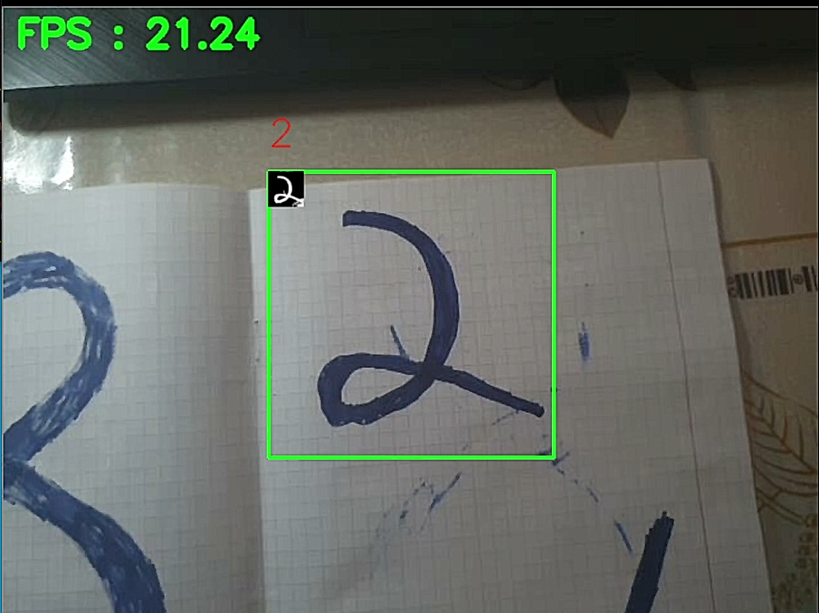
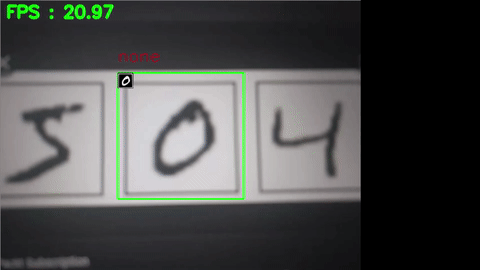

# Real-Time-MNIST
<br>
## Inspiration
Everyone knows what <a href='https://en.wikipedia.org/wiki/MNIST_database'>MNIST</a> is it. 
Recently I wanted to create something connected to <a href='https://en.wikipedia.org/wiki/Object_detection'>object detection</a>. 
But the only device I have is laptop so I didn't have big choice :( So I decided to use MNIST.

## Problem statement
MNNIST dataset contains digits from 0 to 9 as 28x28 gray-scale pixel image. So there are three main problems with MNIST for object detetction:
<ol>
  <li>MNIST main purpose is classification, so we have only one digit per frame</li>
  <li>MNIST doesn't define any noise or background class</li>
  <li>Size of the image are too small</li>
</ol>

First problem was solved in the easiest way possible: let's restrict detection area to some rectangle.<br>
Second problem was solved in a way of adding additional class to images (See <a href='./MNIST Model.ipynb'>MNIST Model.ipynb</a> for more details).<br>
Last problem was partly solved with first one. We have only some restricted area for classification so we can adjust size of this area to later resize image with <a href='https://pillow.readthedocs.io/en/stable/'>PIL</a><br>

## Usage
To install conda environment:
```
conda env create --file environment.yml
```
or with pip:
```
pip install -r requirements.txt
```
*In actual project I use tensorflow 1.13.1, so It's better to train model first:<br>
```
python train_model.py
```
To run project:
```
python do_rt_mnist.py
```

## Examples
### GIF:<br>
<br>

### Videos:<br>
[](https://drive.google.com/file/d/1gppq8kyupItmPZNUUrqWdvrKGKpazlL-/view?usp=sharing)<br><br>
[](https://drive.google.com/file/d/1CDhCJPq_6ZVXEWrnEPmUMazkkvr7UaZU/view?usp=sharing)
